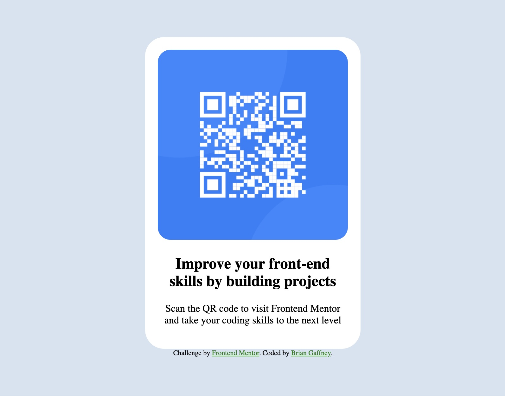

# Frontend Mentor - QR code component solution

This is a solution to the [QR code component challenge on Frontend Mentor](https://www.frontendmentor.io/challenges/qr-code-component-iux_sIO_H). Frontend Mentor challenges help you improve your coding skills by building realistic projects.

## Table of contents

- [Overview](#overview)
  - [Screenshot](#screenshot)
- [My process](#my-process)
  - [Built with](#built-with)
  - [What I learned](#what-i-learned)
  - [Continued development](#continued-development)
- [Author](#author)

## Overview

### Screenshot

## My process

### Built with

- Semantic HTML5 markup
- CSS custom properties
- Flexbox

### What I learned

Mainly, I learned a bit about debugging within browsers and accessebility in terms of device. I also got some much needed practiced working with flexbox.

### Continued development

I'd like to continue by focusing on interactivity within my projects.

## Author

- Frontend Mentor - [@briangaff](https://www.frontendmentor.io/profile/briangaff)
- CSS Battle - [@briangaff] (https://cssbattle.dev/player/briangaff)
